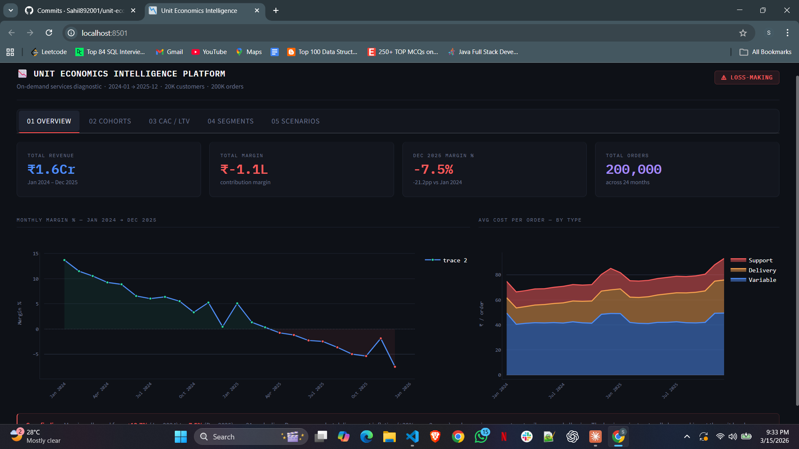
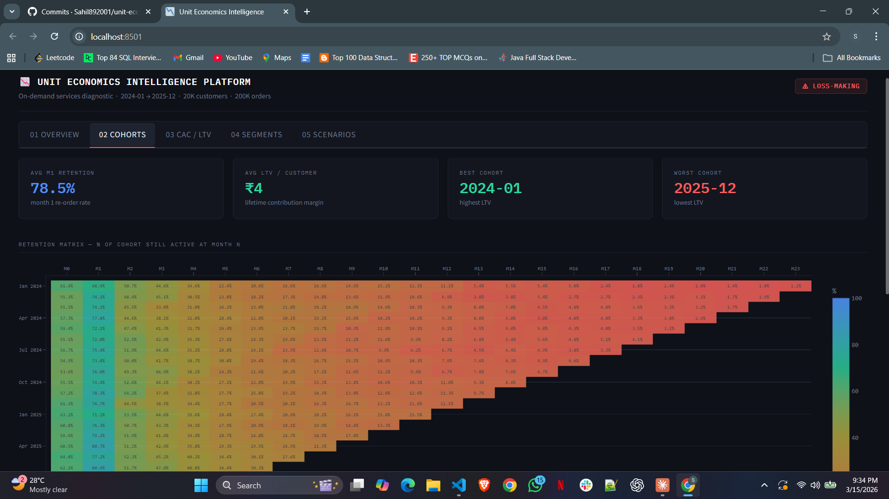
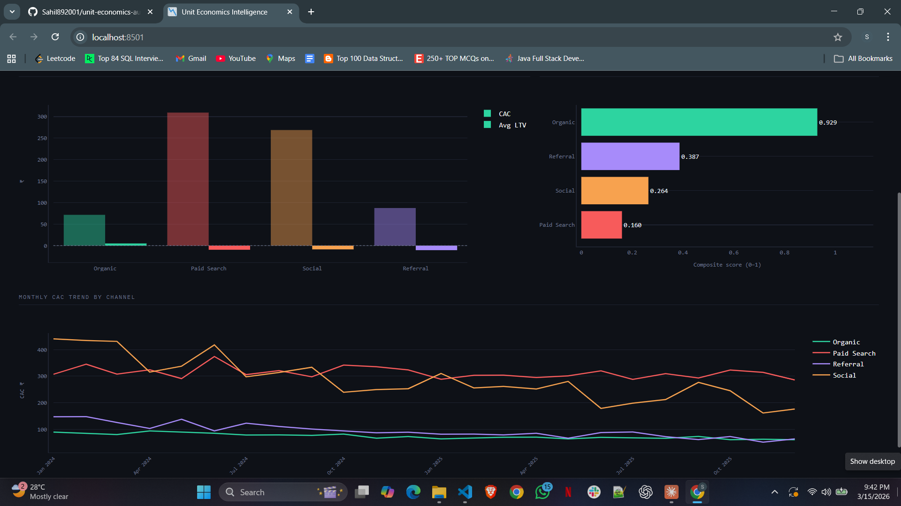
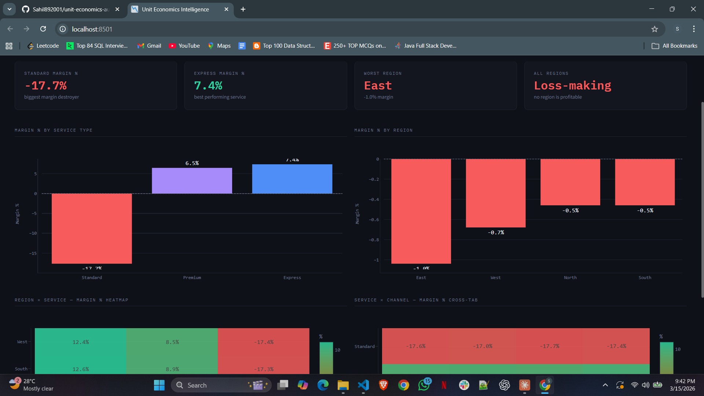
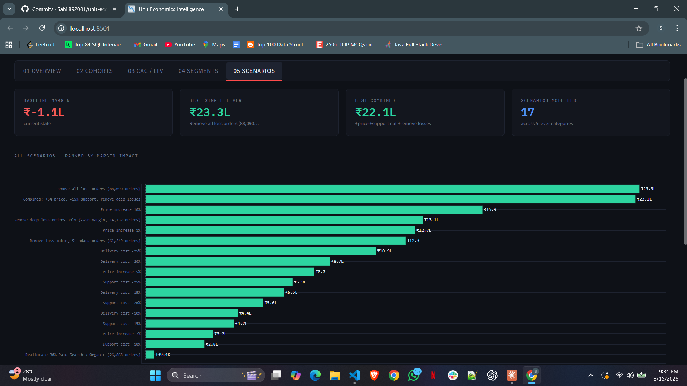

# Unit Economics Intelligence Platform

> Diagnosing why a fast-growing on-demand services business is losing money despite rising revenue — and modelling the path back to profitability.

---

## The Business Problem

A fast-growing on-demand services platform has strong revenue growth but declining profitability. Leadership suspects growth is masking structural cost issues, inefficient acquisition channels, or loss-making customer segments.

This project simulates the role of a data analyst tasked with diagnosing the root causes and delivering data-backed recommendations.

**Core finding:** The business went from **+13.7% contribution margin in Jan 2024** to **-7.5% by Dec 2025** — a 21 percentage point collapse over 24 months — while revenue continued growing.

---

## Key Questions Answered

| Question | Finding |
|----------|---------|
| Are we profitable at the unit level? | No. Total margin is **-₹1.05L** on ₹1.59Cr revenue |
| Which service is the problem? | Standard service is **-17.7% margin**, destroying ₹8.7L |
| Which acquisition channel is worst? | Paid Search: CAC ₹309, LTV **-₹9.67** — net loss ₹319/customer |
| Are newer customers better? | No. Newer cohorts retain better but have **worse LTV** |
| What's the biggest cost problem? | Delivery cost inflation (+30% over 2 years) + support cost spikes |
| What fixes the margin? | Combined: +5% price, -15% support cost, remove deep losses → **+₹23L improvement** |

---

## Project Architecture

```
unit-economics-autopsy/
│
├── config.py                        # Single source of truth — all parameters
├── requirements.txt
│
├── scripts/
│   ├── generate_synthetic_data.py   # Creates 20K customers, 200K orders (2024–2025)
│   ├── clean_and_process_data.py    # 7-stage pipeline: validate → clean → enrich → aggregate
│   └── load_processed_to_sqlite.py  # Loads 10 tables into SQLite with 12 indexes
│
├── src/
│   ├── cohort_analysis.py           # Retention matrix, LTV curves, cohort quality summary
│   ├── cac_ltv_analysis.py          # CAC vs LTV by channel, payback period, efficiency score
│   ├── segment_profitability.py     # Region, service, channel P&L + cross-tab analysis
│   └── scenario_model.py            # ScenarioEngine: 17 scenarios across 5 lever categories
│
├── sql/
│   ├── 01_data_validation.sql       # 9 trust checks before any analysis
│   ├── 02_unit_economics.sql        # Core P&L, margin distribution, cost structure
│   ├── 03_cohort_analysis.sql       # Cohort retention, cumulative LTV, quality summary
│   ├── 04_cac_ltv.sql               # CAC by channel, LTV comparison, monthly trend
│   ├── 05_segment_profitability.sql # Region × service × channel breakdown
│   └── 06_trend_analysis.sql        # Month-by-month deterioration, YoY comparison
│
├── dashboards/
│   └── app.py                       # 5-tab Streamlit dashboard
│
├── data/
│   ├── raw/                         # Generated CSVs (gitignored)
│   ├── processed/                   # Cleaned + enriched tables (gitignored)
│   └── outputs/                     # Analysis output CSVs (gitignored)
│
├── reports/
│   ├── executive_summary.md
│   ├── cac_ltv_notes.md
│   ├── cohort_notes.md
│   ├── segment_profitability_notes.md
│   ├── scenario_analysis.md
│   └── metrics_definitions.md
│
└── logs/                            # Pipeline execution logs
```

---

## Data Pipeline

```
generate_synthetic_data.py
        │
        │  20K customers · 200K orders · Jan 2024–Dec 2025
        │  Churn simulation · Seasonality · Cost inflation · Power users
        ▼
clean_and_process_data.py
        │
        │  50 automated DQ checks · Outlier capping · Feature engineering
        │  Master unit_economics table (200K rows × 35 cols)
        │  Pre-aggregated monthly/channel/service summary tables
        ▼
load_processed_to_sqlite.py
        │
        │  10 tables · 12 performance indexes
        ▼
    SQLite DB
        │
        ├── SQL files (01–06)         — analytical queries
        ├── cohort_analysis.py        — 6 output CSVs
        ├── cac_ltv_analysis.py       — 5 output CSVs
        ├── segment_profitability.py  — 7 output CSVs
        └── scenario_model.py         — 3 output CSVs
                │
                ▼
        dashboards/app.py             — 5-tab Streamlit dashboard
```

---

## Key Findings

### 1. Margin Collapse
The business was profitable in early 2024. By late 2025 it is structurally loss-making:
- Jan 2024: **+13.7% margin**
- Dec 2025: **-7.5% margin**
- Driver: delivery cost per order rose ~30%, support costs spike every December

### 2. Standard Service Is the Margin Killer
| Service | Margin % | Total Margin |
|---------|----------|--------------|
| Express | +7.4% | +₹4.6L |
| Premium | +6.5% | +₹3.1L |
| **Standard** | **-17.7%** | **-₹8.7L** |

Standard's support cost is **27.8% of revenue** vs 10.6% for Express.

### 3. Paid Search Economics Are Broken
| Channel | CAC | Avg LTV | Net Value | Status |
|---------|-----|---------|-----------|--------|
| Organic | ₹71.58 | +₹5.01 | -₹66.57 | Critical |
| Referral | ₹87.40 | -₹10.60 | -₹98.00 | Critical |
| Social | ₹268.81 | -₹8.77 | -₹277.58 | Critical |
| **Paid Search** | **₹309.40** | **-₹9.67** | **-₹319.07** | **Critical** |

No channel reaches payback within 24 months. Organic is the only channel with positive LTV.

### 4. Newer Cohorts Look Better, Aren't
- 2025 cohorts have higher M1 retention (avg ~90%) vs 2024 cohorts (~70%)
- But 2024-01 cohort generates **+₹78.95 LTV/customer**
- Most 2025 cohorts generate **negative LTV**

This is an acquisition quality problem — not a retention problem.

### 5. Scenario Modelling
Top interventions ranked by margin impact:

| Scenario | Margin Delta |
|----------|-------------|
| Remove all loss orders | +₹23.3L |
| Combined (price +5%, support -15%, deep loss removal) | +₹23.1L |
| Price increase 10% | +₹15.9L |
| Remove deep loss orders only | +₹13.1L |
| Delivery cost -25% | +₹10.9L |

---

## Screenshots

| Overview | Cohort Retention | CAC/LTV | Segments | Scenario Modeling |
|----------|-----------------|------------------|------------------|------------------|
|  |  |  |  |  |

> Dashboard built with Streamlit + Plotly. Dark theme, 5 analytical tabs, all charts interactive.

---

## How To Run

### Prerequisites
```bash
git clone https://github.com/Sahil892001/unit-economics-autopsy.git
cd unit-economics-autopsy
python -m venv venv
source venv/bin/activate        # Windows: venv\Scripts\activate
pip install -r requirements.txt
```

### Run the Full Pipeline
```bash
# One command — generates all data then launches dashboard
python setup.py && streamlit run dashboards/app.py
```

Or step by step:

### Run SQL Analysis
Open `data/unit_economics.db` in any SQLite client (DB Browser, DBeaver) and run the files in `sql/` in order 01 → 06.

---

## Data Model

| Table | Rows | Description |
|-------|------|-------------|
| customers | 20,000 | Signup date, channel, region, churn flag |
| orders | 200,000 | Order value, service type, refund flag |
| costs | 200,000 | Variable, delivery, support cost per order |
| marketing_spend | ~2,900 | Daily spend by channel (4 channels × 731 days) |
| support_tickets | ~70,000 | Ticket category, resolution cost |
| unit_economics | 200,000 | Master table: all orders joined with costs + customer attributes |
| monthly_summary | 24 | Pre-aggregated monthly P&L |
| channel_monthly | 96 | Monthly performance by acquisition channel |
| service_monthly | 72 | Monthly performance by service type |
| monthly_costs | 24 | Monthly cost breakdown by type |

### Synthetic Data Design Choices
- **Churn:** Exponential decay, channel-adjusted. Referral stays longest, Paid Search churns fastest
- **Seasonality:** December 35% more orders. July slowest. Express/Premium surge Nov–Jan
- **Cost inflation:** Delivery costs rise ~30% over 2 years. Paid Search spend rises ~50%
- **Power users:** Top 5% of customers by order volume, 6× more likely to order
- **Support outliers:** Lognormal distribution with 2% extreme outliers at 8× base cost

---

## Skills Demonstrated

**Data Engineering**
- Multi-stage processing pipeline with automated data quality checks
- SQLite database design with relational integrity and performance indexing
- Pre-aggregation strategy for dashboard performance

**SQL**
- Window functions (rolling averages, cumulative sums, NTILE)
- Multi-CTE analytical queries
- Year-over-year and cohort comparisons

**Python Analytics**
- Cohort retention matrix construction
- CAC/LTV analysis with payback period modelling
- Scenario and sensitivity analysis using an OOP engine

**Business Acumen**
- Unit economics framework (contribution margin, not just revenue)
- Cohort analysis interpretation (retention vs acquisition quality)
- CAC/LTV benchmarking against industry standards
- Strategic scenario modelling with ranked recommendations

**Visualisation**
- Interactive Streamlit dashboard with 5 analytical tabs
- Plotly heatmaps, trend lines, grouped bars, sensitivity tables

---

## Live Demo

🔗 **[View deployed dashboard →](https://unit-economics-autopsy-adgpypzmqeyoqyzpyejhj3.streamlit.app/)**

Hosted on Streamlit Community Cloud. `setup.py` generates all data on first run.

---

## Tech Stack

| Layer | Tools |
|-------|-------|
| Language | Python 3.10+ |
| Data processing | pandas, numpy |
| Database | SQLite |
| Visualisation | Plotly, Streamlit |
| Analysis | scipy |

---

*Synthetic data. Business context is illustrative.*